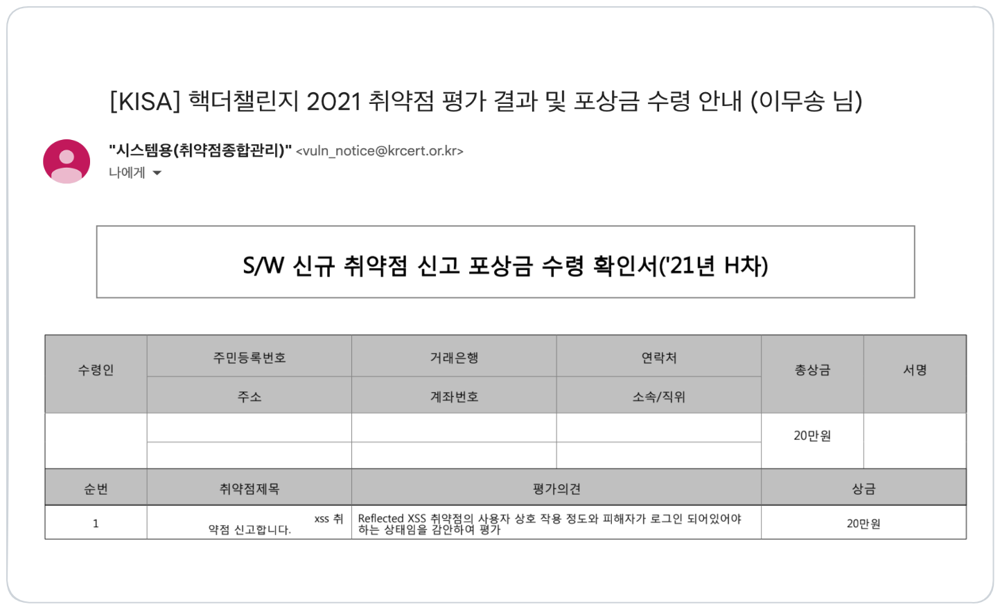
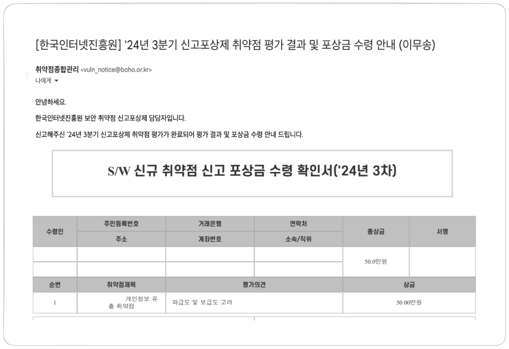
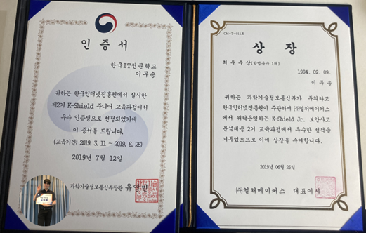
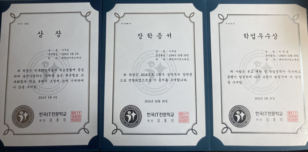

## About

안녕하세요 **이무송**입니다.  
**사용자가 믿고 안심할 수 있는 서비스**를 만드는 데 관심이 많습니다. 
보안과 확장성을 모두 고려한 개발을 지향하며, **안전한 서비스 개발은 개발자의 책임**이라 믿습니다.  
주어진 문제를 깊이 고민하고, **동료들과 더 나은 해결책을 찾아가는 과정**을 즐깁니다.  
**"이무송이 만든 서비스는 안전하다"** 는 신뢰를 얻는 개발자가 되겠습니다.

## 💼 경력 사항

### 오이주식회사

* 기간 : 2019.12.16 ~ 2023.07.01
* 부서 : 침해사고대응본부(정보보안 컨설팅)

**주요 업무** 

* 정보시스템 취약점 진단
* 주요정보통신기반시설, ISO27001, ISMS 인증컨설팅 정보시스템 취약점 진단 수행
* 홈페이지, 모바일 앱, CS 어플리케이션 취약점 진단
* 정보보안 인식제고 훈련 기획, 시스템 구축
* 사내 인프라 구축 및 유지보수 

#

### 경력 기술

**인프라(서버, Web/WAS, DBMS, 네트워크 장비, 정보보호시스템) 취약점 진단**

* 기간 : 2019.12 ~ 2023.07
* 성과 : 취약점 자동 진단 도구를 단독 개발하여 **팀 생산성 300% 증가**

* 세부 업무
    * 보고서 작성을 자동화 하여 엑셀 수작업 최소화
    * 별도의 계정이 필요하지 않은 서버, Web/WAS, Docker 스크립트를 통합하여 운영 담당자와의 **의사소통 효율 300% 증가**
    * 자동화 도구를 확장 가능하도록 설계(설정 값 추출, 진단 결과 출력 기능 분리)하여 새로운 시스템 진단 시 유지보수를 최소화할 수 있도록 리펙터링
    * 최초 개발 이후 환경이 다른 20곳 이상의 고객사를 거쳐 확장, 기능, 오류 등 유지보수 및 개선
    * 진단 도구 사용법 사내 교육 

* 참고 자료 (Youtube)
  
    

 

**사내 인프라 취약점 진단 테스트 및 형상관리 시스템 구축**

* 기간 : 2022.07 ~ 2023.07
* 성과 : 프로젝트 투입 시 **환경구축 시간 20% 단축, 스크립트 오류율 50% 감소**
* 세부 업무

    - 가상화 테스트 환경(proxmox) 및 SSL/VPN(pf-Sense) 구축하여 팀원들의 환경 구축 시간 단축
    - 스크립트 변경 발생 시 GitLab CI/CD를 이용해 각 버전 별 환경에서 배포 전 자동 테스트
    - 기존 이메일로 배포하여 최신화가 유지되지 않았던 스크립트 배포 방식을 GitLab을 통해 최신 버전으로 공유할 수 있도록 개선 

 

**사내 보안 뉴스레터 제작 및 발송**

* 기간 : 2020.02 ~ 2023.01
* 성과 : 최신 보안 이슈를 팀원들에게 빠르게 배포하여 최신 보안동향 파악에 기여
* 세부 업무

    - RSS Feed(구글 알리미, 보안뉴스, 데일리시큐), 네이버 검색 API를 이용해 뉴스 크롤링 시스템 개벌
    - 수동 크롤링 방식을 개선하기 위해 GitLab CI/CD를 활용하여 오전 5시에 보안 뉴스 자동 크롤링 하도록 변경
    - GitLab Pages 기능을 이용하여 뉴스를 선택할 수 있는 웹 페이지를 개발한 후 이메일을 전달하는 시스템을 개발하여 **뉴스 메일 배포시간 70% 단축(10분 → 3분)**
    - Outlook을 사용할 때 발생할 수 있는 이미지 깨짐 현상 해결

* 참고 자료 (Youtube)

    

* Github

    
    
    

 

## 📚 교육 및 외부 활동

### 우아한테크코스

* 기간 : 2024.02 ~ 2024.11
* 활동 내용 

**웹 백엔드 프로젝트 수행**

 - Java 17, Spring Boot3, JPA, Junit 5를 활용한 '총대마켓' 웹 어플리케이션 개발
 - OAuth2.0, JWT을 활용하여 사용자 인증 인가 기능 구현
 - AWS ALB, EC2 및 RDS를 활용하여 고가용성 서비스 인프라 설계, 구축
 - 서비스 다운타임을 최소화 하기 위해 Github CI/CD를 활용하여 Blue & Green 무중단 배포 시스템 구축  
 - swagger-ui, restdocs를 조합하여 테스트코드와 API 문서 일관성 유지

**테크 세미나 발표** 

#

### K-Shield Jr 2기 보안사고 분석대응

* 기간 : 2019.03 ~ 2019.06

* 활동 내용  

**보안 교육 및 실습 이수**

- 시스템해킹, 웹 취약점 및 모의해킹, 리버스엔지니어링, 악성코드분석, 디지털 포렌식, 보안관제 시스템 구축 등 200시간의 보안 교육 이수  
- 교육 과정에서 버퍼오버플로우 취약점을 비롯한 시스템해킹 사례들을 분석하며 시큐어 코딩과 안전한 서비스 개발의 중요성 인지  
    - [해커스쿨 FTZ 풀이](https://www.slideshare.net/slideshow/ftz-170488794/170488794)  
    - [Load of BufferOverflow 풀이](https://www.slideshare.net/fromitive/load-of-buffer-overflow)

**보안 솔루션 프로젝트 수행**  

- QR 코드 피싱 탐지 어플리케이션 **QR-Shield** 개발  
    - QR 코드 스캔 시 악성 URL 여부 사전 탐지  
    - [PPT 자료](https://www.slideshare.net/slideshow/project-of-kshieldopenseminar/172781161)  
    - [Github 저장소](https://github.com/fromitive/QRpreviewer)

**지식 공유 스터디 주최**  

- 교육생 동기들과 ‘발표 스터디’를 개설해 세미나 형식으로 지식을 공유  
- 발표와 토론을 통해 딥 다이브 학습 및 실무 능력 고도화  
    - [DLL Search Order Hijacking](https://www.slideshare.net/slideshow/dll-search-order-hijacking)  
    - [Reverse Engineering](https://www.slideshare.net/slideshow/reverse-engineering-20150209/170490302)

 

## 🏆 수상 내역

### 버그바운티 포상 2회

**Reflect XSS**

**회원 개인정보 유출**

#

### K-Shield Jr 2기 학업 최우수 및 인증서 수여

#

### 성적 우수 졸업 및 장학금 수여

